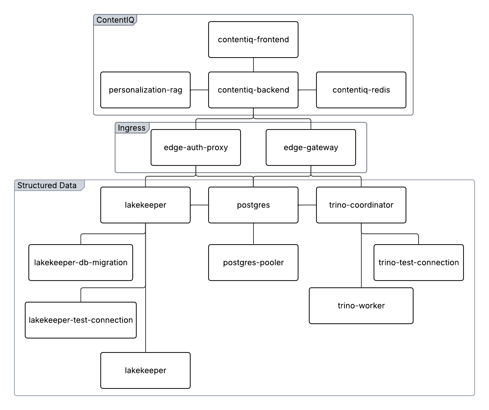

# ContentIQ Operator - Customer Installation Guide

## Table of Contents
1. [Overview](#overview)
2. [How Versioning Works](#how-versioning-works)
3. [Prerequisites](#prerequisites)
4. [Quick Start](#quick-start)
5. [Detailed Installation Steps](#detailed-installation-steps)
6. [Alternative: Installation via OperatorHub UI](#alternative-installation-via-operatorhub-ui)
7. [Configuring Secrets](#configuring-secrets)
8. [Redis Configuration](#redis-configuration)
9. [Updating Secrets After Deployment](#updating-secrets-after-deployment)
10. [Disconnected/On-Prem Deployments](#disconnectedon-prem-deployments)
11. [How Upgrades Work](#how-upgrades-work)
12. [Troubleshooting](#troubleshooting)
13. [File Reference](#file-reference)

---

## Overview

This guide covers installing and managing ContentIQ on OpenShift using the Operator pattern. The operator automatically manages all application components (frontend, backend, RAG service) based on a single Custom Resource configuration.

**Key Benefits:**
- Single declarative configuration file
- Automatic lifecycle management
- Zero-downtime upgrades
- Self-healing deployments

**Note**: This is the **customer package**. All files in this folder are self-contained and work independently.

### Scope and Limitations
- What the operator manages: ContentIQ application components (frontend, backend, RAG) and the Structured Data stack (CNPG/Postgres, Lakekeeper, Trino, edge gateways) via the `ContentIQ` Custom Resource. Structured Data deploys automatically using embedded manifests/charts; you can override with your own rendered manifests.
- What the operator does **not** manage: Additional ingress/TLS/metrics beyond the default Routes it creates.



---

## How Versioning Works

**Operator-Driven App Versions**

- When the operator upgrades, the application automatically upgrades
- Image versions are controlled by the operator release, not by your configuration
- You don't specify image tags in your Custom Resource
- Simplest enterprise deployment model

**How it works:**
```
You apply Custom Resource
        ↓
Operator watches and reconciles
        ↓
Creates: Deployments, Services, Routes, ConfigMaps
        ↓
Manages lifecycle: upgrades, rollouts, health checks
```

---

## Prerequisites

### For Platform Team
- OpenShift cluster (4.x+)
- Cluster admin access (for operator installation)
- Access to DockerHub or internal registry
- `oc` CLI installed

### For App Team
- Access to `contentiq` namespace
- Credentials for external services (AWS, MongoDB, Zilliz, etc.)

### For Disconnected/On-Prem (Air-Gapped)
- Internal registry available and reachable by all cluster nodes (TLS + auth recommended)
- Registry CA or insecure registry configuration applied to the cluster
- Image pull secrets for the internal registry in:
  - `openshift-marketplace`
  - `openshift-operators`
  - `contentiq`
- Ability to apply `oc mirror` output manifests (IDMS/ICSP and CatalogSource)
- Approved offline transfer method to move mirror artifacts into the air-gapped network

**Air-Gap Success Checklist (quick validation)**
- Internal registry reachable from all nodes (DNS + firewall)
- Registry trust configured in OpenShift
- Pull secrets linked in all required namespaces
- Mirror manifests applied (IDMS/ICSP + CatalogSource)
- CatalogSource and CR images point to internal registry

---

## Detailed Installation Steps

### Step 1: Create Namespace

```bash
oc apply -f ansible/manifests/00-namespace.yaml
```

This creates the `contentiq` namespace where the application will run.

### Step 2: Configure Image Pull Secrets

You need to configure OpenShift to pull images from DockerHub and Quay (or your internal registry).

**Disconnected/On-Prem note:** If you are air-gapped, replace DockerHub/Quay with your **internal registry** in all pull secret commands below.

**Important**: Pull secrets are required in **THREE namespaces**:
- **`openshift-marketplace`**: The CatalogSource pod and bundle unpacking pods run here and need to pull the operator catalog and bundle images
- **`openshift-operators`**: The operator pod runs here and needs to pull the operator image
- **`contentiq`**: Application pods (frontend, backend, RAG) run here and need to pull application images

**Step 2a: Configure pull secret for CatalogSource (openshift-marketplace namespace)**

```bash
# Create pull secret in openshift-marketplace namespace
oc create secret docker-registry dockerhub-pull \
  --docker-server=https://index.docker.io/v1/ \
  --docker-username="YOUR_DOCKERHUB_USERNAME" \
  --docker-password="YOUR_DOCKERHUB_TOKEN" \
  --docker-email="your-email@example.com" \
  -n openshift-marketplace

# Also link the secret to the default service account
# OLM creates bundle unpacking pods that use the default service account
# These pods need to pull the operator bundle image
oc secrets link default dockerhub-pull --for=pull -n openshift-marketplace

# NOTE: Do not create the contentiq-operators service account manually.
# OLM creates it when the CatalogSource is applied (Step 3).
# You'll link the pull secret to it after it exists.

```

**Step 2b: Configure pull secret for application pods (contentiq namespace)**

```bash
# Create pull secret in contentiq namespace
oc create secret docker-registry dockerhub-pull \
  --docker-server=https://index.docker.io/v1/ \
  --docker-username="YOUR_DOCKERHUB_USERNAME" \
  --docker-password="YOUR_DOCKERHUB_TOKEN" \
  --docker-email="your-email@example.com" \
  -n contentiq

# Link the secret to the default service account
oc secrets link default dockerhub-pull --for=pull -n contentiq
```

**Step 2c: Configure pull secret for operator pod (openshift-operators namespace)**

The operator runs in `openshift-operators`. Create the secret here now so it is ready when you install the operator in Step 4:

```bash
# Create pull secret in openshift-operators namespace
oc create secret docker-registry dockerhub-pull \
  --docker-server=https://index.docker.io/v1/ \
  --docker-username="YOUR_DOCKERHUB_USERNAME" \
  --docker-password="YOUR_DOCKERHUB_TOKEN" \
  --docker-email="your-email@example.com" \
  -n openshift-operators --dry-run=client -o yaml | oc apply -f -

# Link to the default service account (operator SA is created in Step 4; you'll link to it there)
oc secrets link default dockerhub-pull --for=pull -n openshift-operators
```

**Security Note**: Use DockerHub access tokens, not passwords. Create tokens at: https://hub.docker.com/settings/security

### Step 3: Register Operator Catalog
**Disconnected/on-prem note**: If you are air-gapped, mirror images and update the CatalogSource to your internal registry **before** running this step. See `contentiq-operator-deployment/MIRROR-INTERNAL-REGISTRY-STEPS.md` (Step 8 there).

**For disconnected deployments**: Update the `image` field in `ansible/manifests/02-catalogsource.yaml` to point to your internal registry.

```bash
oc apply -f ansible/manifests/02-catalogsource.yaml
```

This tells OpenShift where to find the operator catalog. The catalog image is:
- `docker.io/symplisticai/contentiq-operator-catalog:1.0.0`

**Link the pull secret before verifying:** The CatalogSource pod must pull the catalog image. To avoid `TRANSIENT_FAILURE` / `ImagePullBackOff`, link the pull secret to the catalog's service accounts **now** (the `contentiq-operators` service account is created by OLM when the CatalogSource is applied):

```bash
# Wait for the service account to exist (created by OLM)
oc get serviceaccount contentiq-operators -n openshift-marketplace

# Link the pull secret to the contentiq-operators service account
# (This service account is used by the CatalogSource pod)
oc secrets link contentiq-operators dockerhub-pull --for=pull -n openshift-marketplace

# CRITICAL: Also link to the default service account
# OLM creates bundle unpacking pods that use the default service account
# These pods need to pull the operator bundle image
oc secrets link default dockerhub-pull --for=pull -n openshift-marketplace

# Restart the catalog pod so it picks up the secret (avoids TRANSIENT_FAILURE on first check)
oc delete pod -l olm.catalogSource=contentiq-operators -n openshift-marketplace
```

**Verify catalog is loaded:** After linking (and pod restart), check that the catalog is READY:

```bash
oc get catalogsource -n openshift-marketplace

# If you linked the secret above, status should become READY shortly. If it still shows CONNECTING/TRANSIENT_FAILURE, wait a minute or run the delete-pod command again, then re-check.
oc describe catalogsource contentiq-operators -n openshift-marketplace

# Verify the CatalogSource pod is Running
oc get pods -n openshift-marketplace | grep contentiq
```

**Troubleshooting**: If the CatalogSource pod shows `ImagePullBackOff`, verify that:
1. The pull secret was created in `openshift-marketplace` namespace
2. The CatalogSource has `spec.secrets: [ "dockerhub-pull" ]` (see `ansible/manifests/02-catalogsource.yaml`) so the catalog pod uses it to pull the image
3. The secret is also linked to the `contentiq-operators` and `default` service accounts (for bundle unpacking)
4. Your DockerHub credentials are correct (use an access token, not password: https://hub.docker.com/settings/security)

### Step 4: Install Operator

```bash
oc apply -f ansible/manifests/03-subscription.yaml
```

This installs the operator and enables automatic upgrades. The operator will:
- Start running as a pod in `openshift-operators` namespace
- Register Custom Resource Definitions (CRDs)
- Be ready to reconcile Custom Resources

**Link pull secret to operator service account**

The pull secret was created in Step 2c. The operator's service account is created by OLM when the subscription is applied. Link the secret to it so the operator pod can pull its image:

```bash
# Wait for the service account to exist (created by OLM when operator is installed)
oc wait --for=condition=Ready serviceaccount/contentiq-operator-controller-manager -n openshift-operators --timeout=60s || \
  oc get serviceaccount contentiq-operator-controller-manager -n openshift-operators

# Link the secret to the operator service account (secret was created in Step 2c)
oc secrets link contentiq-operator-controller-manager dockerhub-pull --for=pull -n openshift-operators
```

**Note**: If the operator pod is already in `ImagePullBackOff`, delete it after linking the secret so it can restart with the new credentials:
```bash
oc delete pod -n openshift-operators -l app.kubernetes.io/name=contentiq-operator
```

**Verify operator is running:**
```bash
oc get pods -n openshift-operators | grep contentiq

# Verify CRD is installed
oc get crd | grep contentiq
```

### Step 5: Configure Backend Secrets

Edit `ansible/secrets/backend-secrets-template.yaml` and replace all `<REPLACE_ME>` values with your actual credentials:

- AWS credentials (access key, secret key, region, S3 bucket info)
- MongoDB connection string
- Zilliz URI and token
- Google OAuth credentials
- Microsoft OAuth credentials
- API keys (GROQ, etc.)
- Other service credentials

**Important**: 
- Never commit secrets to Git
- Use sealed secrets or external secret management in production
- **CRITICAL**: You must set `FRONTEND_URL` and `CORS_ALLOWED_ORIGINS` to match your custom frontend hostname (see Step 6b below)

**Required Environment Variables for Custom Hostnames:**

When using custom hostnames (Step 6b), you **must** update these values in `ansible/secrets/backend-secrets-template.yaml`:

**Get the cluster domain:** Use this to build your hostnames and set `SESSION_COOKIE_DOMAIN` (e.g. if the domain is `apps.example.com`, use `.apps.example.com` for the cookie domain):

```bash
# Get the cluster domain
oc get ingress.config/cluster -o jsonpath='{.spec.domain}'
```

```yaml
stringData:
  # ... other secrets ...
  
  # REQUIRED: Set to match your custom frontend hostname
  # Format: https://contentiq-symplistic-ai.apps.<your-cluster-domain>
  FRONTEND_URL: "https://contentiq-symplistic-ai.apps.example.com"  # UPDATE THIS
  
  # REQUIRED: Set to match your custom frontend hostname (same as FRONTEND_URL)
  CORS_ALLOWED_ORIGINS: "https://contentiq-symplistic-ai.apps.example.com"  # UPDATE THIS
  
  # REQUIRED: Set to your cluster domain (extract from hostname)
  # Example: If hostname is "contentiq.symplistic.ai.apps.example.com", domain is ".apps.example.com"
  SESSION_COOKIE_DOMAIN: ".apps.example.com"  # UPDATE THIS
```

**Note**: If you haven't set custom hostnames yet, you can use the auto-generated format temporarily, but you'll need to update these values after setting custom hostnames in Step 6b.

**Apply the backend secret:**
```bash
oc apply -f ansible/secrets/backend-secrets-template.yaml
```

**Step 5b: Configure RAG (personalization-rag) Secrets**

The RAG service also requires a secret. Edit `ansible/secrets/rag-secrets-template.yaml`, replace all placeholder values (e.g. `<REPLACE_ME>`) with your actual credentials, then apply:

```bash
oc apply -f ansible/secrets/rag-secrets-template.yaml
```

The secret is created as `personalization-api-secrets` in the `contentiq` namespace. The operator must be configured to mount this secret on the RAG deployment (see [Configuring Secrets](#configuring-secrets)).

### Step 6: Deploy ContentIQ Instance
**Disconnected/on-prem note**: If you are air-gapped, update the ContentIQ CR to internal images **before** applying it. See `contentiq-operator-deployment/MIRROR-INTERNAL-REGISTRY-STEPS.md` (Step 9 there).

Edit `ansible/manifests/contentiq-custom-resource.yaml` to configure your deployment (images, pull secrets, hostnames):

**Important**: You must configure custom hostnames for routes to avoid the auto-generated format (`contentiq-frontend-contentiq.<domain>`).

**Step 6a: Get Your OpenShift Cluster Domain**

First, find your cluster's application domain:

```bash
# Get the cluster domain
oc get ingress.config/cluster -o jsonpath='{.spec.domain}'

# Or check an existing route to see the domain pattern
oc get routes -A -o jsonpath='{.items[0].spec.host}' | cut -d'.' -f2-
```

**Step 6b: Configure Images and Custom Hostnames**

Edit `ansible/manifests/contentiq-custom-resource.yaml`:

```yaml
apiVersion: contentiq.symplistic.ai/v1alpha1
kind: ContentIQ
metadata:
  name: contentiq-instance
  namespace: contentiq
spec:
  namespace: contentiq

  # REQUIRED: Set application images (use your registry/mirror)
  images:
    frontend: "docker.io/symplisticai/contentiq-frontend:1.0.9"        # REPLACE with your mirrored image
    backend: "docker.io/symplisticai/contentiq-backend:1.0.16"         # REPLACE with your mirrored image
    rag: "docker.io/symplisticai/personalization-rag:1.0.3"            # REPLACE with your mirrored image

  # Optional: registry auth for app images
  # imagePullSecrets:
  #   - name: dockerhub-pull

  backendReplicas: 1
  frontendReplicas: 1
  ragReplicas: 1

  routes:
    frontend:
      enabled: true
      # REQUIRED: Set custom hostname
      # Format: contentiq.symplistic.ai.apps.<your-cluster-domain>
      # Replace <your-cluster-domain> with your actual cluster domain from Step 6a
      hostname: "contentiq-symplistic-ai.apps.example.com"  # UPDATE THIS
    backend:
      enabled: true
      hostname: "api-contentiq-symplistic-ai.apps.example.com"  # UPDATE THIS
      cors:
        enabled: true
```

**Note**: If you want to use a fully qualified domain like `contentiq.symplistic.ai` (without the `.apps` part), you'll need to:
1. Configure DNS to point `contentiq.symplistic.ai` to your OpenShift router IP
2. Use `hostname: "contentiq.symplistic.ai"` in the route configuration

**Permissions Note (custom hostnames):**
- Setting `spec.host` on Routes requires `routes/custom-host`. If the operator service account lacks this, route creation will be denied.
- Options:
  - Have a cluster admin grant the operator SA permission to create routes with hosts in the `contentiq` namespace.
  - Or omit `hostname` fields to let OpenShift auto-assign hosts (no extra permission needed).

**Apply the Custom Resource:**
```bash
oc apply -f ansible/manifests/contentiq-custom-resource.yaml
```

The operator will automatically create:
- Deployments for frontend, backend, and RAG
- Services for all components
- Routes (if enabled)
- ConfigMaps with configuration
- Frontend ConfigMap with auto-generated backend URL

**Verify deployment:**
```bash
oc get pods -n contentiq
oc get routes -n contentiq

# Verify all pods are running the image versions you expect (e.g. after an upgrade)
oc get pods -n contentiq -o jsonpath='{range .items[*]}{.metadata.name}{"\t"}{range .spec.containers[*]}{.image}{" @ "}{.imageID}{"\n"}{end}{end}'

# Verify the frontend URL (should match your custom hostname)
oc get route contentiq-frontend -n contentiq -o jsonpath='{.spec.host}'
echo ""

# Verify the backend URL
oc get route contentiq-backend -n contentiq -o jsonpath='{.spec.host}'
echo ""

# Check Custom Resource status
oc describe contentiq contentiq-instance -n contentiq
```

If any pods are not ready or the CR shows warnings, run the Structured Data health check below.

**Optional: Structured Data health check (if the stack looks unhealthy)**

```bash
# Check Structured Data-related pods
oc get pods -n contentiq | grep -E "lakekeeper|trino|edge"

# Check for Structured Data errors in events
oc get events -n contentiq --sort-by=.lastTimestamp | grep -E "StructuredDataReconcileFailed|StructuredData"
```

See Troubleshooting: [CNPG Webhook Certificate Missing ca.crt](#cnpg-webhook-certificate-missing-cacrt)

**Align backend secret with your hostnames (if not already set in Step 5):**

Wait until the Routes exist (from the Custom Resource) before running these commands.

```bash
# Get your frontend hostname (matches the Custom Resource)
FRONTEND_HOSTNAME=$(oc get route contentiq-frontend -n contentiq -o jsonpath='{.spec.host}')

# Update the backend secret with the correct frontend URL
oc patch secret contentiq-backend-secrets -n contentiq --type='json' \
  -p="[{\"op\": \"replace\", \"path\": \"/data/FRONTEND_URL\", \"value\": \"$(echo -n "https://${FRONTEND_HOSTNAME}" | base64)\"}]"

oc patch secret contentiq-backend-secrets -n contentiq --type='json' \
  -p="[{\"op\": \"replace\", \"path\": \"/data/CORS_ALLOWED_ORIGINS\", \"value\": \"$(echo -n "https://${FRONTEND_HOSTNAME}" | base64)\"}]"

# Get backend hostname for Microsoft redirect URI
BACKEND_HOSTNAME=$(oc get route contentiq-backend -n contentiq -o jsonpath='{.spec.host}')
oc patch secret contentiq-backend-secrets -n contentiq --type='json' \
  -p="[{\"op\": \"replace\", \"path\": \"/data/MICROSOFT_REDIRECT_URI\", \"value\": \"$(echo -n "https://${BACKEND_HOSTNAME}/api/connections/microsoft/auth/microsoft/callback" | base64)\"}]"

# Extract domain for SESSION_COOKIE_DOMAIN (e.g., ".apps.example.com")
DOMAIN=$(echo "${FRONTEND_HOSTNAME}" | sed 's/^[^.]*\\.//' | sed 's/^[^.]*\\.//')
oc patch secret contentiq-backend-secrets -n contentiq --type='json' \
  -p="[{\"op\": \"replace\", \"path\": \"/data/SESSION_COOKIE_DOMAIN\", \"value\": \"$(echo -n ".${DOMAIN}" | base64)\"}]"

# Restart backend pods to pick up new secret values
oc rollout restart deployment/contentiq-backend -n contentiq
```

**Why this is required:**
- The operator sets CORS at the **route level** (HAProxy) automatically using the frontend hostname
- However, your **backend application code** also needs to know the frontend URL for:
  - CORS validation in Flask/Python code
  - OAuth redirect URIs (Microsoft, Google)
  - Session cookie domain configuration
- If these don't match, you'll get CORS errors when the frontend tries to call the backend API

**Access the application:**
- **Frontend URL**: `https://contentiq.symplistic.ai.apps.<your-cluster-domain>` (or your configured hostname)
- **Backend URL**: `https://api.contentiq.symplistic.ai.apps.<your-cluster-domain>` (or your configured hostname)

### Step 7: Structured Data Stack (Lakekeeper/Trino)
- The operator deploys the lakehouse components (CNPG/Postgres, Lakekeeper, Trino, edge gateways) automatically.
- Embedded manifests are the default. Only set `spec.structuredData.useEmbeddedCharts=false` and provide ConfigMaps if you need fully custom manifests.
- If you disable embedded manifests, your ConfigMaps must include the full stack (CNPG operator/CRDs, Postgres cluster, Lakekeeper, Trino, edge gateways, and routes).
- Structured Data images can be overridden without editing manifests by setting `spec.structuredData.images` (defaults: Lakekeeper `quay.io/lakekeeper/catalog:v0.11.1`, Trino `trinodb/trino:477`, Postgres `ghcr.io/cloudnative-pg/postgresql:18-standard-trixie`).
- **Edge gateway auth**: When edge gateways are enabled, requests routed through `edge-gateway` require a Bearer token. The operator automatically creates `lakekeeper-auth-tokens` and injects `LAKEHOUSE_SERVICE_TOKEN` into `contentiq-backend-secrets` so the backend can authenticate by default.
- **Auto-wired Lakehouse endpoints**: The operator automatically sets `LAKEHOUSE_INGRESS_HOST` and `TRINO_URL` in `contentiq-backend-secrets` based on which services exist (`edge-gateway`, legacy edge services, or direct `trino` fallback). If it updates these values, it restarts the backend deployment to pick up the changes.
- **Auto-created Lakekeeper defaults**: The operator creates the default project `contentIQ` and warehouse `contentiq-warehouse` using the AWS credentials + `S3_BUCKET_NAME` from `contentiq-backend-secrets`. Make sure the bucket exists and the credentials are valid.
- **Host-based routing (optional)**: The edge gateway supports host-based routing, but auto-generated OpenShift route hosts will not match the defaults (`lakekeeper.local`, `trino.local`). If you want host-based routing, set custom Route hosts to match your edge-gateway values or override the edge-gateway config accordingly. Otherwise, the gateway's default server uses path-based routing.
- **Required for Enterprise/On-Prem**:
  - **SCC Requirements**: All Structured Data components require the `nonroot-v2` Security Context Constraint (SCC):
    - CNPG controller manager (for Postgres) - See [CNPG Controller Manager Pod Not Starting (SCC Issue)](#cnpg-controller-manager-pod-not-starting-scc-issue)
    - Lakekeeper pods - See [Lakekeeper Pods Not Starting (SCC Issue)](#lakekeeper-pods-not-starting-scc-issue)
    - Trino pods - See [Trino Pods Not Starting (SCC Issue)](#trino-pods-not-starting-scc-issue)
  - If CNPG controller manager crashes with webhook errors, webhook configurations may be missing. See the [CNPG Controller Manager Pod Crashing (Webhook Configuration Missing)](#cnpg-controller-manager-pod-crashing-webhook-configuration-missing) troubleshooting section.
- Steps:
  1. **Grant SCC to CNPG service account** (required):
     ```bash
     SA_NAME=$(oc get deployment cnpg-controller-manager -n cnpg-system -o jsonpath='{.spec.template.spec.serviceAccountName}')
     SA_NAME=${SA_NAME:-default}
     oc adm policy add-scc-to-user nonroot-v2 -n cnpg-system -z $SA_NAME
     ```
  2. **Grant SCC to Lakekeeper and Trino service accounts** (required):
     ```bash
     oc adm policy add-scc-to-user nonroot-v2 -n contentiq -z lakekeeper
     oc adm policy add-scc-to-user nonroot-v2 -n contentiq -z trino

     # Link pull secrets to service accounts (for image pulling)
     oc secrets link lakekeeper dockerhub-pull --for=pull -n contentiq
     oc secrets link trino dockerhub-pull --for=pull -n contentiq
     ```

     **Note**: If your mirrored registry requires auth for the CNPG Postgres image, link the pull secret to the `default` service account as well:
     ```bash
     oc secrets link default dockerhub-pull --for=pull -n contentiq
     ```
  3. **Enable pgvector in the Lakekeeper metadata database** (required for embeddings):
     - The CNPG **standard** Postgres image includes pgvector, but the extension must be enabled **per database**.
     ```bash
     PG_POD=$(oc get pod -n contentiq -l cnpg.io/cluster=postgres -o jsonpath='{.items[0].metadata.name}')

     # Check if pgvector is installed in the target DB
     oc exec -n contentiq "$PG_POD" -c postgres -- \
       psql -U postgres -d lakekeeper_metadata -c "SELECT extname FROM pg_extension WHERE extname='vector';"

     # If no rows returned, enable it
     oc exec -n contentiq "$PG_POD" -c postgres -- \
       psql -U postgres -d lakekeeper_metadata -c "CREATE EXTENSION IF NOT EXISTS vector;"
     ```
     **Note**: If you see `Peer authentication failed`, run the command as `postgres` (shown above) or connect via TCP with a password.
  4. Ensure `ansible/secrets/backend-secrets-template.yaml` is populated (AWS keys, `S3_BUCKET_NAME`, etc.) and applied. If using the RAG service, also ensure `ansible/secrets/rag-secrets-template.yaml` is populated and applied.

     **Customer note (migrations)**:
     - If you deploy normally (no DB wipe after the migration), you should not need to touch this.
     - If you recreate the DB/cluster, delete the migration job to re-run it:
       ```bash
       oc delete job/lakekeeper-db-migration-1 -n contentiq
       ```
  5. In `ansible/manifests/contentiq-custom-resource.yaml`, optional overrides:
     ```yaml
     structuredData:
       useEmbeddedCharts: true
       # manifestConfigMaps:
       #   - my-rendered-structured-data-manifests  # only if useEmbeddedCharts=false
       images:
         lakekeeper: "quay.io/lakekeeper/catalog:v0.11.1"   # override if mirrored
         trino: "trinodb/trino:477"                        # override if mirrored
         postgres: "ghcr.io/cloudnative-pg/postgresql:18-standard-trixie"  # override if mirrored
     ```
  6. Apply/patch the ContentIQ CR.

### Step 8: Deployment Health Checks

```bash
# Current pod status
oc get pods -n contentiq -o wide

# Operator status (namespace may vary; common is openshift-operators)
oc get pods -n openshift-operators | grep contentiq || true

# Routes
oc get routes -n contentiq

# Services and endpoints
oc get svc -n contentiq
oc get endpoints -n contentiq lakekeeper trino

# Recent events (bash)
oc get events -n contentiq --sort-by=.lastTimestamp | tail -n 20
```

**Note**: If you see SCC-related errors for Trino pods (e.g., "unable to validate against any security context constraint"), see the troubleshooting section: [Trino Pods Not Starting (SCC Issue)](#trino-pods-not-starting-scc-issue). Old error events from failed replicasets may appear even after the fix is applied - these are harmless.

**Note**: If you see SCC-related errors for Trino pods (e.g., "unable to validate against any security context constraint"), see the troubleshooting section: [Trino Pods Not Starting (SCC Issue)](#trino-pods-not-starting-scc-issue). Old error events from failed replicasets may appear even after the fix is applied - these are harmless.

**⚠️ IMPORTANT: Structured Data Troubleshooting Checks**

**Note**: The following checks should be performed **after pods start running** (typically after Step 6 or Step 7). If you run these commands too early in the installation process, the pods may not exist yet and the commands won't apply properly. Wait until you see pods being created before running these troubleshooting steps.

These are common issues that can prevent Structured Data components from starting. Check and fix them if needed:

**1. CNPG Controller Manager Pod Not Starting (SCC Issue)**

Check if CNPG controller manager pod is failing due to SCC issues:

```bash
# Check CNPG controller manager pod status
oc get pods -n cnpg-system

# Check for SCC errors in events
oc get events -n cnpg-system --sort-by=.lastTimestamp | grep -i "security context constraint\|scc\|forbidden"

# If you see SCC errors, grant nonroot-v2 SCC to CNPG service account
SA_NAME=$(oc get deployment cnpg-controller-manager -n cnpg-system -o jsonpath='{.spec.template.spec.serviceAccountName}')
SA_NAME=${SA_NAME:-default}
oc adm policy add-scc-to-user nonroot-v2 -n cnpg-system -z $SA_NAME

# Verify the fix
oc get pods -n cnpg-system
```

**2. Lakekeeper Pods Not Starting (SCC Issue)**

Check if Lakekeeper pods are failing due to SCC issues:

```bash
# Check Lakekeeper pod status
oc get pods -n contentiq | grep lakekeeper

# Check for SCC errors in events
oc get events -n contentiq --sort-by=.lastTimestamp | grep -i "lakekeeper.*security context constraint\|lakekeeper.*scc\|lakekeeper.*forbidden"

# If you see SCC errors, grant nonroot-v2 SCC to Lakekeeper service account
oc adm policy add-scc-to-user nonroot-v2 -n contentiq -z lakekeeper

# Link pull secrets (if not already done)
oc secrets link lakekeeper dockerhub-pull --for=pull -n contentiq

# Verify the fix
oc get pods -n contentiq | grep lakekeeper
```

**3. Trino Pods Not Starting (SCC Issue)**

Check if Trino pods are failing due to SCC issues:

```bash
# Check Trino pod status
oc get pods -n contentiq | grep trino

# Check for SCC errors in events
oc get events -n contentiq --sort-by=.lastTimestamp | grep -i "trino.*security context constraint\|trino.*scc\|trino.*forbidden"

# If you see SCC errors, grant nonroot-v2 SCC to Trino service account
oc adm policy add-scc-to-user nonroot-v2 -n contentiq -z trino

# Link pull secrets (if not already done)
oc secrets link trino dockerhub-pull --for=pull -n contentiq

# Verify the fix
oc get pods -n contentiq | grep trino
```

**4. CNPG Controller Manager Pod Crashing (Webhook Configuration Missing)**

Check if CNPG controller manager pod is crashing due to missing webhook configurations:

```bash
# Check CNPG controller manager pod status (should show CrashLoopBackOff if crashing)
oc get pods -n cnpg-system

# Check pod logs for webhook errors
oc logs -n cnpg-system -l app.kubernetes.io/name=cloudnative-pg --tail=20 | grep -i "webhook\|mutatingwebhook\|validatingwebhook"

# Check if webhook configurations exist
oc get mutatingwebhookconfigurations | grep cnpg
oc get validatingwebhookconfigurations | grep cnpg

# If webhook configurations are missing and pod is crashing, grant webhook creation permissions (for legacy/pre-1.0.1 builds only)
# Note: In operator builds 1.0.1 and later, these are created automatically
oc patch clusterrole cnpg-manager --type='json' -p='[{"op": "add", "path": "/rules/-", "value": {"apiGroups": ["admissionregistration.k8s.io"], "resources": ["mutatingwebhookconfigurations", "validatingwebhookconfigurations"], "verbs": ["create"]}}]'

# Restart the pod after RBAC changes
oc delete pod -n cnpg-system -l app.kubernetes.io/name=cloudnative-pg

# Verify the fix
oc get pods -n cnpg-system
oc get mutatingwebhookconfigurations | grep cnpg
oc get validatingwebhookconfigurations | grep cnpg
```

**5. CNPG Webhook Certificate Missing ca.crt**

Check if the CNPG webhook certificate is missing the ca.crt:

```bash
# Check for webhook certificate errors in events
oc get events -n contentiq --sort-by=.lastTimestamp | grep -E "StructuredDataReconcileFailed|cnpg-webhook-cert"

# Check if ca.crt exists in the webhook cert secret
oc get secret cnpg-webhook-cert -n cnpg-system -o jsonpath='{.data.ca\.crt}' 2>/dev/null || echo "ca.crt missing"

# If ca.crt is missing, copy it from cnpg-ca-secret
CA_CERT=$(oc get secret cnpg-ca-secret -n cnpg-system -o jsonpath='{.data.ca\.crt}')
if [ -n "$CA_CERT" ]; then
  oc patch secret cnpg-webhook-cert -n cnpg-system --type='json' \
    -p="[{\"op\":\"add\",\"path\":\"/data/ca.crt\",\"value\":\"${CA_CERT}\"}]"
  echo "ca.crt added to webhook cert secret"
else
  echo "Warning: cnpg-ca-secret not found or ca.crt missing"
fi

# Verify ca.crt exists
oc get secret cnpg-webhook-cert -n cnpg-system -o jsonpath='{.data.ca\.crt}' && echo "" || echo "ca.crt still missing"
```


For detailed troubleshooting information, see the [Troubleshooting](#troubleshooting) section.

**Extended validation (optional but recommended):**
```bash
# CNPG cluster running + pgvector available
PG_POD=$(oc get pod -n contentiq -l cnpg.io/cluster=postgres -o jsonpath='{.items[0].metadata.name}')
oc exec -n contentiq "$PG_POD" -c postgres -- psql -U postgres -d lakekeeper_metadata -c "SELECT extname FROM pg_extension WHERE extname='vector';"

# If no rows returned, enable pgvector
oc exec -n contentiq "$PG_POD" -c postgres -- psql -U postgres -d lakekeeper_metadata -c "CREATE EXTENSION IF NOT EXISTS vector;"

# Backend/Frontend health endpoints (adjust route names if customized)
BACKEND_HOST=$(oc get route contentiq-backend -n contentiq -o jsonpath='{.spec.host}')
FRONTEND_HOST=$(oc get route contentiq-frontend -n contentiq -o jsonpath='{.spec.host}')
curl -k "https://${BACKEND_HOST}/api/support/health"
curl -k "https://${FRONTEND_HOST}/"

# Lakekeeper migrations completed
oc get job/lakekeeper-db-migration-1 -n contentiq -o jsonpath='{.status.succeeded}'; echo

# Lakekeeper default warehouse exists
TOKEN=$(oc get secret lakekeeper-auth-tokens -n contentiq -o jsonpath='{.data.SERVICE_TOKEN}' | base64 -d)
oc exec -n contentiq deploy/lakekeeper -- sh -c "curl -s -H \"Authorization: Bearer $TOKEN\" http://localhost:8181/management/v1/warehouse"

# Trino catalog connectivity
oc exec -n contentiq deploy/trino-coordinator -- trino --server http://localhost:8080 --execute "SHOW CATALOGS; SHOW SCHEMAS FROM iceberg;"

# Backend wired to lakehouse endpoints
oc exec -n contentiq deploy/contentiq-backend -- printenv | grep -E "LAKEHOUSE_|TRINO_"
```

**Rerun the one-shot test pods (Lakekeeper bootstrap + Trino query):**
```bash
oc delete pod lakekeeper-test-bootstrap trino-test-connection -n contentiq --ignore-not-found

cat <<'EOF' | oc apply -f -
apiVersion: v1
kind: Pod
metadata:
  name: lakekeeper-test-bootstrap
  namespace: contentiq
  annotations:
    helm.sh/hook: test
spec:
  serviceAccountName: lakekeeper
  restartPolicy: Never
  containers:
  - name: base
    image: curlimages/curl:latest
    command: ["sh","-c"]
    args:
      - |
        set -e
        TOKEN=$(cat /var/run/secrets/kubernetes.io/serviceaccount/token)
        BOOTSTRAP_URL="http://lakekeeper:8181/management/v1/bootstrap"
        RESPONSE=$(curl --location "$BOOTSTRAP_URL" \
          --header 'Content-Type: application/json' \
          --header "Authorization: Bearer $TOKEN" \
          --data '{"accept-terms-of-use": true}' \
          --write-out "HTTP_CODE:%{http_code}" --silent --output /dev/null)
        echo $RESPONSE
---
apiVersion: v1
kind: Pod
metadata:
  name: trino-test-connection
  namespace: contentiq
  annotations:
    helm.sh/hook: test
spec:
  restartPolicy: Never
  containers:
  - name: cli
    image: trinodb/trino:477
    command: ["trino"]
    args:
      - "trino://trino:8080"
      - "--user=admin"
      - "--debug"
      - "--execute=SELECT COUNT(*) FROM tpch.tiny.nation"
      - "--no-progress"
EOF

# Check completion + logs
oc get pod lakekeeper-test-bootstrap trino-test-connection -n contentiq -o wide
oc logs lakekeeper-test-bootstrap -n contentiq
oc logs trino-test-connection -n contentiq
```

---

## Configuring Secrets

### Backend Secrets

The backend requires a Kubernetes Secret with all service credentials. The template is in `ansible/secrets/backend-secrets-template.yaml`.

**Required secrets include:**
- AWS credentials
- MongoDB connection string
- Zilliz credentials
- OAuth credentials (Google, Microsoft)
- API keys
- Other service-specific credentials

**Important Notes:**
- Edit the template file and replace `REPLACE_ME` with actual values
- Never commit secrets to version control
- Use sealed secrets or external secret management in production
- The secret is applied as `contentiq-backend-secrets` (referenced by the operator)

### RAG (personalization-rag) Secrets

The RAG service (personalization-rag) requires a separate Kubernetes Secret. The template is in `ansible/secrets/rag-secrets-template.yaml`.

**Variables in the template include:**
- MongoDB URI and database name
- Zilliz URI and token (vector store)
- IBM API key, Orchestrate base URL, and token URL (Watson Orchestrate)
- RAG internal token (for backend–RAG auth)
- Together API key (optional, if using Together for reranking)

**Important Notes:**
- Edit the template and replace placeholder values (e.g. `<REPLACE_WITH_...>`) with your actual values
- The secret is applied as `personalization-api-secrets` in the `contentiq` namespace
- The operator must be configured to mount this secret on the RAG deployment (e.g. via `envFrom: personalization-api-secrets`) when supported

---

## Redis Configuration

Redis is **operator-managed** by default. The operator deploys a single Redis instance and injects a `REDIS_URL` into the backend pods.

Key details:
- Redis runs as `contentiq-redis` (Deployment or StatefulSet) and a Service.
- The operator creates `contentiq-redis-secrets` with `REDIS_PASSWORD` and `REDIS_URL`.
- The backend automatically consumes `REDIS_URL` from `contentiq-redis-secrets`.

Modes:
- `ephemeral` (default): Deployment with no PVC. The operator sets Redis `dir` to `/tmp` to avoid OpenShift permission issues with arbitrary UIDs.
- `persistent`: StatefulSet + PVC for `/data`. Use when you need Redis data to survive restarts.
- `external`: Use an existing Redis and provide a Secret with `REDIS_URL`.

Image and password overrides:
- Use `spec.images.redis` for air-gap/mirrored images (preferred), or `spec.redis.image` as a fallback.
- If you set `spec.redis.password`, the operator updates the managed Redis secret and rolls Redis and backend pods so the new credentials take effect.

### Persistent Redis on OpenShift (recommended settings)
OpenShift assigns arbitrary UIDs by default. For persistent Redis, set an `fsGroup` that is allowed in your namespace so the mounted PVC is writable.

Steps:
1. Get the allowed supplemental group range for your namespace:
   `oc get namespace contentiq -o jsonpath='{.metadata.annotations.openshift\.io/sa\.scc\.supplemental-groups}'`
2. Pick a group ID from the range (typically the first value).
3. Set `spec.redis.mode: persistent` and provide persistence + security context.

Example:
```yaml
spec:
  redis:
    mode: "persistent"
    persistence:
      size: "5Gi"
      storageClass: "<your-storage-class>"
      accessModes: ["ReadWriteOnce"]
    securityContext:
      fsGroup: 1000680000
      fsGroupChangePolicy: "OnRootMismatch"
```

### External Redis
Create a Secret containing `REDIS_URL` (example: `redis://:password@host:6379/0`) and reference it in the CR:

```yaml
spec:
  redis:
    mode: "external"
    external:
      secretName: "external-redis"
      urlKey: "REDIS_URL"
```

---

## Updating Secrets After Deployment

### Important: Secrets Don't Auto-Update Running Pods

When you update a Kubernetes Secret, **running pods do NOT automatically pick up the changes**. This is because:
1. Secrets are injected as environment variables when pods start
2. Environment variables are set once at container startup
3. Kubernetes doesn't watch for secret changes and restart pods automatically

### How to Update Secrets

#### Method 1: Update via YAML (Recommended)

**Backend secrets:**
```bash
# 1. Edit the secret YAML file
vi ansible/secrets/backend-secrets-template.yaml  # Update values

# 2. Apply the updated secret
oc apply -f ansible/secrets/backend-secrets-template.yaml

# 3. Restart backend pods to pick up new secrets
oc rollout restart deployment/contentiq-backend -n contentiq

# 4. Monitor the rollout
oc rollout status deployment/contentiq-backend -n contentiq
```

**RAG secrets:**
```bash
# 1. Edit the RAG secret YAML file
vi ansible/secrets/rag-secrets-template.yaml  # Update values

# 2. Apply the updated secret
oc apply -f ansible/secrets/rag-secrets-template.yaml

# 3. Restart RAG pods to pick up new secrets
oc rollout restart deployment/personalization-rag -n contentiq

# 4. Monitor the rollout
oc rollout status deployment/personalization-rag -n contentiq
```

**Note**: This performs a rolling restart (zero downtime) - new pods start with new secrets while old pods continue running until new ones are ready.

#### Method 2: Update via CLI

```bash
# Update a single secret value
oc set env secret/contentiq-backend-secrets \
  AWS_ACCESS_KEY_ID="new-key" \
  -n contentiq

# Or update multiple values using patch
oc patch secret contentiq-backend-secrets \
  -n contentiq \
  --type='json' \
  -p='[{"op": "replace", "path": "/data/AWS_ACCESS_KEY_ID", "value": "'$(echo -n "new-key" | base64)'"}]'

# Restart pods
oc rollout restart deployment/contentiq-backend -n contentiq
```

#### Method 3: Edit in OpenShift Console

1. Navigate to Secrets in OpenShift Console
2. Edit the `contentiq-backend-secrets` secret (or `personalization-api-secrets` for RAG)
3. Save changes
4. Restart the deployment: `oc rollout restart deployment/contentiq-backend -n contentiq` (or `deployment/personalization-rag` for RAG)

### Verifying Secret Updates

```bash
# Check that new pods are running
oc get pods -n contentiq

# Check backend pod logs to verify new secrets are being used
oc logs deployment/contentiq-backend -n contentiq

# Check RAG pod logs (if using RAG secrets)
oc logs deployment/personalization-rag -n contentiq

# Verify secrets were updated
oc get secret contentiq-backend-secrets -n contentiq -o yaml
oc get secret personalization-api-secrets -n contentiq -o yaml
```

---

## Disconnected/On-Prem Deployments

For disconnected OpenShift clusters (no internet access), you must mirror all ContentIQ images to an internal registry.

**Quick link:** For a single end-to-end mirroring guide covering all required images, see `contentiq-operator-deployment/MIRROR-ALL-IMAGES.md`.
**Internal registry (OpenShift) guide:** `contentiq-operator-deployment/MIRROR-INTERNAL-REGISTRY-STEPS.md`.

### Air-Gapped Quick Steps (Recommended)
1) Mirror images to your internal registry using `MIRROR-ALL-IMAGES.md` (oc mirror archive -> import).
2) Configure registry trust in OpenShift (CA or insecure registry).
3) Create and link pull secrets for the internal registry in:
   - `openshift-marketplace`
   - `openshift-operators`
   - `contentiq`
4) Apply generated mirror manifests (IDMS/ICSP + CatalogSource from `oc-mirror-workspace/results-*`).
5) Update the CatalogSource and Custom Resource to point at your internal registry.
6) Continue with the standard installation steps in this guide.

### Where This Fits in the Main Install Steps (Very Important)
Use this ordering to avoid image pull failures:

1) **Before Step 3 (Register Operator Catalog)**: Mirror images + apply mirror rules (IDMS/ICSP), then ensure the **CatalogSource** points at the internal registry.
   - If you haven't applied `ansible/manifests/02-catalogsource.yaml` yet, edit it first and then apply.
   - If the CatalogSource already exists, use the patch + pod restart in `MIRROR-INTERNAL-REGISTRY-STEPS.md` (Step 8 there).

2) **Before Step 6 (Deploy ContentIQ Instance)**: Ensure the **ContentIQ CR** points at internal images.
   - If you haven't applied the CR yet, set `spec.images` (and `spec.structuredData.images`) in `ansible/manifests/contentiq-custom-resource.yaml` before applying.
   - If the CR already exists, use the patch in `MIRROR-INTERNAL-REGISTRY-STEPS.md` (Step 9 there).

### Registry Trust (Required)
If your internal registry uses a **self-signed cert**, add its CA to OpenShift:

```bash
# Save the registry CA cert locally (example path)
REGISTRY_CA=/path/to/registry-ca.crt

# Create a ConfigMap with the CA (key must match the registry host:port)
oc create configmap registry-ca -n openshift-config \
  --from-file=<internal-registry>:<port>=$REGISTRY_CA

# Tell OpenShift to trust that CA
oc patch image.config.openshift.io/cluster --type=merge \
  -p '{"spec":{"additionalTrustedCA":{"name":"registry-ca"}}}'
```

If your registry is **HTTP/insecure** (not recommended for production):
```bash
oc patch image.config.openshift.io/cluster --type=merge \
  -p '{"spec":{"registrySources":{"insecureRegistries":["<internal-registry>:<port>"]}}}'
```

### Pull Secrets for Internal Registry (Required)
Create and link pull secrets in all required namespaces:

```bash
oc create secret docker-registry internal-registry-creds \
  --docker-server=<internal-registry>:<port> \
  --docker-username=<REGISTRY_USER> \
  --docker-password=<REGISTRY_PASSWORD> \
  --docker-email=unused \
  -n openshift-marketplace

oc create secret docker-registry internal-registry-creds \
  --docker-server=<internal-registry>:<port> \
  --docker-username=<REGISTRY_USER> \
  --docker-password=<REGISTRY_PASSWORD> \
  --docker-email=unused \
  -n openshift-operators

oc create secret docker-registry internal-registry-creds \
  --docker-server=<internal-registry>:<port> \
  --docker-username=<REGISTRY_USER> \
  --docker-password=<REGISTRY_PASSWORD> \
  --docker-email=unused \
  -n contentiq

oc secrets link default internal-registry-creds --for=pull -n openshift-marketplace
oc secrets link default internal-registry-creds --for=pull -n openshift-operators
oc secrets link default internal-registry-creds --for=pull -n contentiq
```

### Required Images

All images are listed in `ansible/06-image-list.txt`:

**Application Images:**
- `docker.io/symplisticai/contentiq-frontend:1.0.9`
- `docker.io/symplisticai/contentiq-backend:1.0.16`
- `docker.io/symplisticai/personalization-rag:1.0.3`

**Operator Images:**
- `docker.io/symplisticai/contentiq-operator:1.0.0`
- `docker.io/symplisticai/contentiq-operator-bundle:1.0.0`
- `docker.io/symplisticai/contentiq-operator-catalog:1.0.0`

**Structured Data Stack (operator-managed):**
- `ghcr.io/cloudnative-pg/cloudnative-pg:1.24.1`
- `ghcr.io/cloudnative-pg/postgresql:18-standard-trixie`
- `quay.io/lakekeeper/catalog:v0.11.1`
- `trinodb/trino:477`
- `curlimages/curl:latest`
- `docker.io/library/python:3.11-alpine`
- `docker.io/library/nginx:1.27-alpine`

**Notes:**
- Embedded manifests/charts for the Structured Data stack are included; you can mirror the images above for air-gapped installs.
- If you prefer to use your own rendered manifests, set `spec.structuredData.useEmbeddedCharts=false` and provide ConfigMaps containing the manifests (see Structured Data section).
- Use `spec.structuredData.images` to point the Structured Data stack to your mirrored registry (no manifest edits needed).
- Backend credentials must be provided via `contentiq-backend-secrets` (from `ansible/secrets/backend-secrets-template.yaml`); the operator consumes this secret directly.
- RAG credentials must be provided via `personalization-api-secrets` (from `ansible/secrets/rag-secrets-template.yaml`) when the operator is configured to mount RAG secrets on the personalization-rag deployment.
- If you keep embedded manifests, use an ImageContentSourcePolicy (example above) to rewrite pulls to your mirrored registries; no manifest edits needed.
- **SCC requirements (Structured Data stack)**: All Structured Data components require the `nonroot-v2` Security Context Constraint. This is **required** since Structured Data is always deployed. See the troubleshooting sections for setup instructions:
  - [CNPG Controller Manager Pod Not Starting (SCC Issue)](#cnpg-controller-manager-pod-not-starting-scc-issue)
  - [Lakekeeper Pods Not Starting (SCC Issue)](#lakekeeper-pods-not-starting-scc-issue)
  - [Lakekeeper DB Migration Job Fails (POSTGRES_URL missing)](#lakekeeper-db-migration-job-fails-postgres_url-missing)
  - [Trino Pods Not Starting (SCC Issue)](#trino-pods-not-starting-scc-issue)
  Grant the SCCs before deploying the Structured Data stack.

### Mirroring Methods

**Important:** After mirroring, apply mirror rules (ImageDigestMirrorSet or ImageContentSourcePolicy) and update CatalogSource/CR images to use the internal registry.

#### Method 1: Using skopeo (Recommended for Simple Cases)

```bash
# Login to both registries
skopeo login docker.io
skopeo login quay.io
skopeo login ghcr.io
skopeo login <internal-registry-url>

# Mirror each image
skopeo copy --all docker://docker.io/symplisticai/contentiq-frontend:1.0.9 \
  docker://<internal-registry>/symplisticai/contentiq-frontend:1.0.9

skopeo copy --all docker://docker.io/symplisticai/contentiq-backend:1.0.16 \
  docker://<internal-registry>/symplisticai/contentiq-backend:1.0.16

skopeo copy --all docker://docker.io/symplisticai/personalization-rag:1.0.3 \
  docker://<internal-registry>/symplisticai/personalization-rag:1.0.3

# Mirror operator images
skopeo copy --all docker://docker.io/symplisticai/contentiq-operator:1.0.0 \
  docker://<internal-registry>/symplisticai/contentiq-operator:1.0.0

skopeo copy --all docker://docker.io/symplisticai/contentiq-operator-bundle:1.0.0 \
  docker://<internal-registry>/symplisticai/contentiq-operator-bundle:1.0.0

skopeo copy --all docker://docker.io/symplisticai/contentiq-operator-catalog:1.0.0 \
  docker://<internal-registry>/symplisticai/contentiq-operator-catalog:1.0.0
```

**Note:** Mirror all images listed in `ansible/06-image-list.txt`, including those from `ghcr.io` and `quay.io`.

#### Method 2: Using oc mirror (Recommended for OpenShift)

Create `mirror-config.yaml` (include all upstream registries used by app + Structured Data images):
```yaml
apiVersion: v1
kind: ImageContentSourcePolicy
metadata:
  name: contentiq-mirror
spec:
  repositoryDigestMirrors:
    - mirrors:  # App/operator images
        - <internal-registry>/symplisticai
      source: docker.io/symplisticai
    - mirrors:  # CNPG operator + Postgres image (pgvector)
        - <internal-registry>/cloudnative-pg
      source: ghcr.io/cloudnative-pg
    - mirrors:  # Lakekeeper
        - <internal-registry>/lakekeeper
      source: quay.io/lakekeeper
    - mirrors:  # Trino
        - <internal-registry>/trinodb
      source: docker.io/trinodb
    - mirrors:  # curl (Lakekeeper hook)
        - <internal-registry>/curlimages
      source: docker.io/curlimages
```

Then use `oc mirror` to sync images.

### Update Configuration for Internal Registry

After mirroring, update:

1. **CatalogSource** (`ansible/manifests/02-catalogsource.yaml`):
   ```yaml
   spec:
     image: <internal-registry>/symplisticai/contentiq-operator-catalog:1.0.0
   ```

2. **Pull secrets** to authenticate with internal registry instead of DockerHub

3. **ContentIQ Custom Resource** (`ansible/manifests/contentiq-custom-resource.yaml`):
   - Set `spec.images` to the mirrored image locations in your registry
   - (Optional) Set `spec.imagePullSecrets` if your registry requires authentication

---

## How Upgrades Work

**📌 For a complete guide on the upgrade process**, see **[UPGRADE-PROCESS-GUIDE.md](../UPGRADE-PROCESS-GUIDE.md)** which covers both vendor and customer perspectives in detail.

Upgrade flow with CR-driven images:

1. **Vendor releases new operator version** (e.g., 1.0.0 → 1.1.0)
2. **Platform team mirrors new operator/bundle/catalog images** to the internal registry (if disconnected) and updates CatalogSource if needed
3. **OLM upgrades the operator** (Automatic Subscription) or you apply the new Subscription manually
4. **App team updates `spec.images` in the ContentIQ Custom Resource** to the desired app image tags in your registry
5. Operator reconciles and rolls out the app pods using the image tags you set in the CR

**To check for upgrades:**
```bash
oc get subscription contentiq -n openshift-operators
oc get installplan -n openshift-operators
```

---

## Troubleshooting

### Operator Not Appearing in OperatorHub

```bash
# Check CatalogSource status
oc get catalogsource -n openshift-marketplace
oc describe catalogsource contentiq-operators -n openshift-marketplace

# Check CatalogSource pod status (IMPORTANT: pod must be running)
oc get pods -n openshift-marketplace | grep contentiq

# Check for image pull errors
oc get events -n openshift-marketplace --sort-by='.lastTimestamp'
```

**Common issues:**
- CatalogSource pod in `ImagePullBackOff` - see "CatalogSource Pod in ImagePullBackOff" section below
- Catalog image not accessible (check pull secrets in `openshift-marketplace` namespace)
- Network connectivity issues
- Catalog image pull errors

### CatalogSource Pod in ImagePullBackOff

If the CatalogSource pod cannot pull the catalog image, the operator will not install.

```bash
# Check CatalogSource pod status
oc get pods -n openshift-marketplace | grep contentiq

# Check pod details for error messages
oc describe pod <catalog-pod-name> -n openshift-marketplace
```

**Symptoms:**
- Pod status shows `ImagePullBackOff` or `ErrImagePull`
- Error message: "requested access to the resource is denied"
- Subscription shows `ResolutionFailed` condition

**Solution:**

The CatalogSource pod runs in `openshift-marketplace` namespace and needs pull secrets. Use **both** (1) CatalogSource `spec.secrets` and (2) service account links:

```bash
# 1. Verify pull secret exists in openshift-marketplace
oc get secrets -n openshift-marketplace | grep dockerhub

# 2. If missing, create the pull secret
oc create secret docker-registry dockerhub-pull \
  --docker-server=https://index.docker.io/v1/ \
  --docker-username="YOUR_DOCKERHUB_USERNAME" \
  --docker-password="YOUR_DOCKERHUB_TOKEN" \
  --docker-email="your-email@example.com" \
  -n openshift-marketplace

# 3. Ensure CatalogSource uses the secret (so the catalog image can be pulled)
# Edit ansible/manifests/02-catalogsource.yaml and add under spec:  secrets: [ "dockerhub-pull" ]
# Then re-apply:
oc apply -f ansible/manifests/02-catalogsource.yaml

# 4. Ensure the service account exists (created automatically with CatalogSource)
oc get serviceaccount contentiq-operators -n openshift-marketplace

# 5. Link to the contentiq-operators and default service accounts (for catalog pod and bundle unpacking)
oc secrets link contentiq-operators dockerhub-pull --for=pull -n openshift-marketplace
oc secrets link default dockerhub-pull --for=pull -n openshift-marketplace

# 6. If there are any bundle unpacking pods in ImagePullBackOff, delete them
oc get pods -n openshift-marketplace | grep contentiq
# If you see any pods with ImagePullBackOff, delete them:
# oc delete pod <pod-name> -n openshift-marketplace

# 7. Delete the CatalogSource pod to restart with new secret
oc delete pod -l olm.catalogSource=contentiq-operators -n openshift-marketplace

# 8. Verify pod starts successfully
oc get pods -n openshift-marketplace | grep contentiq
```

**Note**: Pull secrets are needed in **multiple namespaces**:
- `openshift-marketplace`: For CatalogSource pod and bundle unpacking pods
- `openshift-operators`: For the operator pod itself
- `contentiq`: For application pods (frontend, backend, RAG)

### Operator Pod in ImagePullBackOff

If the operator pod cannot pull the operator image, the operator will not start and CRDs will not be registered.

```bash
# Check operator pod status
oc get pods -n openshift-operators | grep contentiq

# Check pod details for error messages
oc describe pod <operator-pod-name> -n openshift-operators
```

**Symptoms:**
- Pod status shows `ImagePullBackOff` or `ErrImagePull`
- Error message: "requested access to the resource is denied"
- CRD is not installed (you'll get "no matches for kind ContentIQ" when trying to apply Custom Resource)
- Subscription shows operator is installed but pod is not running

**Solution:**

The operator pod runs in `openshift-operators` namespace and needs pull secrets there:

```bash
# 1. Verify pull secret exists in openshift-operators
oc get secrets -n openshift-operators | grep dockerhub

# 2. If missing, create the pull secret
oc create secret docker-registry dockerhub-pull \
  --docker-server=https://index.docker.io/v1/ \
  --docker-username="YOUR_DOCKERHUB_USERNAME" \
  --docker-password="YOUR_DOCKERHUB_TOKEN" \
  --docker-email="your-email@example.com" \
  -n openshift-operators

# 3. Wait for the service account to exist (created by OLM when operator is installed)
# If it doesn't exist yet, wait a moment and re-check
oc wait --for=condition=Ready serviceaccount/contentiq-operator-controller-manager -n openshift-operators --timeout=60s || \
  oc get serviceaccount contentiq-operator-controller-manager -n openshift-operators

# 4. Link to the operator service account
# The operator pod uses contentiq-operator-controller-manager service account
oc secrets link contentiq-operator-controller-manager dockerhub-pull --for=pull -n openshift-operators

# 5. CRITICAL: Also link to the default service account
# OLM may create pods that use the default service account
oc secrets link default dockerhub-pull --for=pull -n openshift-operators

# 6. Delete the operator pod to restart with new secret
oc delete pod -n openshift-operators -l name=contentiq-operator-controller-manager

# 7. Verify pod starts successfully and CRD is registered
oc get pods -n openshift-operators | grep contentiq
oc get crd | grep contentiq
```

**Note**: The operator service account (`contentiq-operator-controller-manager`) is created automatically when the operator is installed via OLM. The wait command above will ensure the service account exists before attempting to link the secret.

### Operator Pod Not Starting

```bash
# Check operator pod logs
oc logs -n openshift-operators -l name=contentiq-operator

# Verify CRDs are installed
oc get crd | grep contentiq

# Check RBAC permissions
oc get clusterrolebinding | grep contentiq

# Check pod status
oc get pods -n openshift-operators | grep contentiq
oc describe pod <operator-pod-name> -n openshift-operators
```

### Operator Not Reconciling Custom Resources

**Symptoms:**
- Operator pod is running successfully
- Logs show "starting manager" and metrics server running
- No controller registration logs
- No reconciliation logs
- Custom Resource exists but has empty status fields
- No application pods are created

**Diagnosis:**

```bash
# Check operator logs for controller registration
oc logs -n openshift-operators -l name=contentiq-operator | grep -i controller

# Check if controller is registered (should see "Starting Controller" or "Starting EventSource")
oc logs -n openshift-operators -l name=contentiq-operator | grep -i "Starting Controller\|Starting EventSource"

# Verify Custom Resource exists
oc get contentiq -n contentiq

# Check Custom Resource status (should show deployment status if reconciled)
oc describe contentiq contentiq-instance -n contentiq
```

**Likely Cause:**
This indicates the controller is not registered with the operator manager. This is typically a code issue in the operator (missing controller setup in `main.go`), not a deployment configuration issue.

**Solution:**
This requires a fix from the operator vendor. The operator needs to:
1. Import the ContentIQ API types and add them to the scheme
2. Import the controller package
3. Register the controller with the manager using `SetupWithManager()`

**If you're the operator vendor:**
See the troubleshooting section in `VENDOR-GUIDE.md` for details on fixing controller registration.

**Temporary Workaround:**
If you have access to the operator source code, ensure `cmd/main.go` includes:
- Import of `api/v1alpha1` package
- Import of `controllers` package
- Adding API types to scheme: `utilruntime.Must(contentiqv1alpha1.AddToScheme(scheme))`
- Controller registration after manager creation

After fixing, rebuild the operator image and update the bundle/catalog.

### Application Pods Not Starting

```bash
# Check Custom Resource status
oc describe contentiq contentiq-instance -n contentiq

# Verify secrets exist
oc get secrets -n contentiq

# Check image pull secrets
oc get sa default -n contentiq -o yaml

# Review pod events
oc get pods -n contentiq
oc describe pod <pod-name> -n contentiq
oc get events -n contentiq --sort-by='.lastTimestamp'
```

**Common issues:**
- Missing or incorrect secrets
- Image pull authentication failures
- Resource limits too low
- Health check failures

### Routes Not Accessible

```bash
# Verify routes are created
oc get routes -n contentiq

# Check route status
oc describe route <route-name> -n contentiq

# Verify services exist
oc get svc -n contentiq

# Test route
curl -k https://$(oc get route contentiq-frontend -n contentiq -o jsonpath='{.spec.host}')
```

### Frontend Not Connecting to Backend

```bash
# Verify frontend ConfigMap has correct backend URL
oc get configmap frontend-env -n contentiq -o yaml

# Check backend route exists
oc get route contentiq-backend -n contentiq

# Verify backend is accessible
curl -k https://$(oc get route contentiq-backend -n contentiq -o jsonpath='{.spec.host}')/api/support/health
```

### Secret Updates Not Taking Effect

```bash
# Verify secret was updated
oc get secret contentiq-backend-secrets -n contentiq -o yaml

# Check if deployment was restarted
oc get deployment contentiq-backend -n contentiq

# Restart deployment if needed
oc rollout restart deployment/contentiq-backend -n contentiq

# Monitor rollout
oc rollout status deployment/contentiq-backend -n contentiq
```

### CNPG Controller Manager Pod Not Starting (SCC Issue)

**Symptoms:**
- CNPG controller manager pod fails to start in `cnpg-system` namespace
- Events show: `Error creating: pods "cnpg-controller-manager-..." is forbidden: unable to validate against any security context constraint`
- Error mentions: `runAsUser: Invalid value: 10001: must be in the ranges: [1000660000, 1000669999]`
- All SCCs show as "Forbidden: not usable by user or serviceaccount"

**Root Cause:**
The CNPG operator's controller manager pod requires:
1. Running as user ID `10001` (not in OpenShift's default restricted UID range)
2. Using `seccompProfile: RuntimeDefault` security profile
3. The default `restricted-v2` SCC doesn't allow these settings

**Solution: Grant nonroot-v2 SCC to CNPG Service Account**

This is a **required step for enterprise on-premise deployments**. The `nonroot-v2` SCC allows non-root user IDs and seccomp profiles while maintaining security restrictions.

**Step 1: Identify the CNPG service account**

```bash
# Find the service account used by CNPG controller manager
oc get deployment cnpg-controller-manager -n cnpg-system -o jsonpath='{.spec.template.spec.serviceAccountName}'
echo ""
```

This will typically return `cnpg-manager` or `default`. If it returns nothing, it's using the `default` service account.

**Step 2: Grant the nonroot-v2 SCC**

```bash
# Get the service account name (or use 'default' if empty)
SA_NAME=$(oc get deployment cnpg-controller-manager -n cnpg-system -o jsonpath='{.spec.template.spec.serviceAccountName}')
SA_NAME=${SA_NAME:-default}

# Grant nonroot-v2 SCC to the service account
oc adm policy add-scc-to-user nonroot-v2 -n cnpg-system -z $SA_NAME
```

**Step 3: Verify the fix**

```bash
# Check that the SCC was granted (RoleBinding should include the service account)
oc describe rolebinding -n cnpg-system system:openshift:scc:nonroot-v2

# Check if the pod can now start
oc get pods -n cnpg-system

# Monitor events to confirm no more SCC errors
oc get events -n cnpg-system --sort-by=.lastTimestamp --no-headers | Select-Object -Last 5
```

**Why nonroot-v2?**
- Allows any non-root user ID (including `10001`)
- Supports `runtime/default` seccomp profile (required by CNPG)
- Maintains security: drops all capabilities, no privilege escalation
- More restrictive than `anyuid` but less restrictive than `restricted-v2`

**Enterprise Considerations:**
- **Documentation**: Document this SCC grant in your deployment runbook
- **Compliance**: Some enterprises require UID ranges; `nonroot-v2` allows any non-root UID
- **Upgrades**: This SCC grant persists across operator upgrades, but verify after major upgrades
- **Alternative**: If your security policy requires specific UID ranges, consider patching the CNPG deployment to use a UID in the `[1000660000, 1000669999]` range, then use `restricted-v2` instead

**If the pod still doesn't start after granting SCC:**

```bash
# Delete the failed replicaset to force a retry
oc get replicaset -n cnpg-system
oc delete replicaset <failed-replicaset-name> -n cnpg-system

# Wait and check pod status
oc get pods -n cnpg-system -w
```

**Note**: This fix is required **before** the Structured Data stack can deploy successfully. If you see this error, the CNPG operator (which manages PostgreSQL for the Structured Data stack) cannot start.

### Lakekeeper Pods Not Starting (SCC Issue)

**Symptoms:**
- Lakekeeper pods fail to start in `contentiq` namespace
- Events show: `Error creating: pods "lakekeeper-..." is forbidden: unable to validate against any security context constraint`
- Error mentions: `runAsUser: Invalid value: 65532` or `runAsUser: Invalid value: 999: must be in the ranges: [1000670000, 1000679999]`
- All SCCs show as "Forbidden: not usable by user or serviceaccount"

**Root Cause:**
Lakekeeper pods require:
1. Running as user IDs `65532` or `999` (not in OpenShift's default restricted UID range)
2. The default `restricted-v2` SCC doesn't allow these UIDs

**Solution: Grant SCC to Lakekeeper Service Account**

This is a **required step** since Structured Data is always deployed. The operator creates the `lakekeeper` service account and sets it on the Lakekeeper deployment and migration job, so no manual patching is needed.

**Step 1: Grant SCC and link pull secret**

```bash
# Grant nonroot-v2 SCC to the Lakekeeper service account
oc adm policy add-scc-to-user nonroot-v2 -n contentiq -z lakekeeper

# Link pull secrets to the service account (for image pulling)
oc secrets link lakekeeper dockerhub-pull --for=pull -n contentiq
```

**Alternative for on-prem deployments**: Mirror `quay.io/lakekeeper/catalog:v0.11.1` (default) to your internal registry and update the Custom Resource to use the mirrored image (see `spec.structuredData.images.lakekeeper` in Step 6).

**Step 2: Verify the fix**

```bash
# Check that the SCC was granted (RoleBinding should include the service account)
oc describe rolebinding -n contentiq system:openshift:scc:nonroot-v2 | grep lakekeeper

# Check if pods can now start
oc get pods -n contentiq | grep lakekeeper

# Monitor events to confirm no more SCC errors
oc get events -n contentiq --sort-by=.lastTimestamp --no-headers | Select-Object -Last 10 | Select-String lakekeeper
```

**If pods still don't start after granting SCC:**

```bash
# Delete any failed replicasets to force a retry
oc get replicaset -n contentiq | grep lakekeeper
oc delete replicaset <failed-replicaset-name> -n contentiq

# Wait and check pod status
oc get pods -n contentiq | grep lakekeeper
```

**Note**: This fix is required for the Structured Data stack. Lakekeeper pods will not start without the `nonroot-v2` SCC grant.

### Trino Pods Not Starting (SCC Issue)

**Symptoms:**
- Trino pods fail to start in `contentiq` namespace
- Events show: `Error creating: pods "trino-..." is forbidden: unable to validate against any security context constraint`
- Error mentions: `runAsUser: Invalid value: 1000: must be in the ranges: [1000670000, 1000679999]`
- All SCCs show as "Forbidden: not usable by user or serviceaccount"

**Root Cause:**
Trino pods require:
1. Running as user ID `1000` (not in OpenShift's default restricted UID range)
2. The default `restricted-v2` SCC doesn't allow this UID

**Solution: Grant SCC to Trino Service Account**

This is a **required step** since Structured Data is always deployed. The operator creates the `trino` service account and sets it on the Trino deployments, so no manual patching is needed.

**Step 1: Grant SCC and link pull secret**

```bash
# Grant nonroot-v2 SCC to the Trino service account
oc adm policy add-scc-to-user nonroot-v2 -n contentiq -z trino

# Link pull secrets to the service account (for image pulling)
oc secrets link trino dockerhub-pull --for=pull -n contentiq
```

**Step 2: Verify the fix**

```bash
# Check that the SCC was granted (RoleBinding should include the service account)
oc describe rolebinding -n contentiq system:openshift:scc:nonroot-v2 | grep trino

# Check if pods can now start
oc get pods -n contentiq | grep trino

# Monitor events to confirm no more SCC errors
oc get events -n contentiq --sort-by=.lastTimestamp --no-headers | Select-Object -Last 10 | Select-String trino
```

**Step 3: Clean up old failed replicasets (optional but recommended)**

After applying the fix, you may still see error events from old failed replicasets in the event history. These are harmless but can be confusing. Clean them up to remove the error events:

```bash
# List all replicasets to identify failed ones (those with 0 replicas)
oc get replicaset -n contentiq | grep trino

# Delete failed replicasets (replace with actual names)
oc delete replicaset <failed-replicaset-name> -n contentiq
```

### CNPG Controller Manager Pod Crashing (Webhook Configuration Missing)

**Symptoms:**
- CNPG controller manager pod starts but immediately crashes with `CrashLoopBackOff`
- Pod logs show: `unable to setup PKI infrastructure: mutatingwebhookconfigurations.admissionregistration.k8s.io "cnpg-mutating-webhook-configuration" not found`
- Or: `validatingwebhookconfigurations.admissionregistration.k8s.io "cnpg-validating-webhook-configuration" not found`
- Pod exits with error code 1

**Root Cause:**
The CNPG operator requires mutating and validating webhook configurations to exist before it can start. These webhook configurations are typically created during operator installation, but may be missing if:
- CNPG was deployed via embedded manifests/charts rather than OLM
- The webhook configurations were deleted or not created properly
- The operator service account lacks permission to create webhook configurations

**Note:** In operator builds that include the webhook/RBAC fixes (1.0.1 and later), these permissions and webhook configurations are created automatically by the operator. Only follow the steps below if you are running an older build or have manually removed the CNPG webhooks.

**Solution (for legacy/pre-1.0.1 builds only): Grant Webhook Creation Permissions**

**Step 1: Grant create permission for webhook configurations**

The CNPG service account needs permission to create webhook configurations:

```bash
# Add create permission for webhook configurations to the CNPG ClusterRole
oc patch clusterrole cnpg-manager --type='json' -p='[{"op": "add", "path": "/rules/-", "value": {"apiGroups": ["admissionregistration.k8s.io"], "resources": ["mutatingwebhookconfigurations", "validatingwebhookconfigurations"], "verbs": ["create"]}}]'
```

**Step 2: Restart the CNPG controller manager pod (if you just patched RBAC)**

```bash
# Delete the pod to force a restart after RBAC changes
oc delete pod -n cnpg-system -l app.kubernetes.io/name=cloudnative-pg
```

**Step 3: Verify the fix**

```bash
# Check that webhook configurations exist
oc get mutatingwebhookconfigurations | grep cnpg
oc get validatingwebhookconfigurations | grep cnpg

# Check pod status (should be Running)
oc get pods -n cnpg-system

# Check logs for successful startup
oc logs -n cnpg-system -l app.kubernetes.io/name=cloudnative-pg --tail=20
```

You should see logs indicating:
- `Starting CloudNativePG Operator`
- `Serving webhook server`
- `Starting Controller` messages for cluster, backup, pooler, etc.
- `Starting workers` messages

**Note**: The operator now waits for CNPG to publish `cnpg-webhook-cert` and patches the webhook configurations with the CA bundle before creating the Postgres cluster. You may briefly see TLS handshake errors while the certificates are generated, but they should clear without manual intervention.

**If the pod still crashes after these steps:**

1. Verify the webhook service exists:
   ```bash
   oc get service cnpg-webhook-service -n cnpg-system
   ```

2. Check for other errors in the logs:
   ```bash
   oc logs -n cnpg-system -l app.kubernetes.io/name=cloudnative-pg --tail=50
   ```

3. Verify ClusterRole permissions:
   ```bash
   oc get clusterrole cnpg-manager -o yaml | grep -A 5 "admissionregistration"
   ```

**Enterprise Considerations:**
- **Documentation**: Document these webhook configurations in your deployment runbook
- **Automation**: Consider creating these webhook configurations as part of your deployment automation
- **Upgrades**: Verify webhook configurations persist after operator upgrades
- **Alternative**: If deploying CNPG via OLM directly (not via ContentIQ operator), the webhook configurations should be created automatically during installation

### CNPG Webhook Certificate Missing ca.crt

**Symptoms:**
- ContentIQ operator reports: `CNPG webhook certificate secret cnpg-system/cnpg-webhook-cert is missing ca.crt`
- Postgres pods may still be running despite the error
- Operator reconciliation shows warnings in events

**Check for the error in events:**

```bash
oc get events -n contentiq --sort-by=.lastTimestamp | grep -E "StructuredDataReconcileFailed|cnpg-webhook-cert"
```

**Root Cause:**
The `cnpg-webhook-cert` secret is created by CNPG with only `tls.crt` and `tls.key`, but the ContentIQ operator expects `ca.crt` to be present for webhook configuration patching.

**Solution: Copy CA Certificate to Webhook Secret**

The CA certificate exists in a separate secret (`cnpg-ca-secret`). Copy it to the webhook cert secret:

```bash
# Get the CA certificate from cnpg-ca-secret
CA_CERT=$(oc get secret cnpg-ca-secret -n cnpg-system -o jsonpath='{.data.ca\.crt}')

# Add ca.crt to the webhook cert secret
oc patch secret cnpg-webhook-cert -n cnpg-system --type='json' \
  -p="[{\"op\":\"add\",\"path\":\"/data/ca.crt\",\"value\":\"${CA_CERT}\"}]"

# Verify ca.crt exists
oc get secret cnpg-webhook-cert -n cnpg-system -o jsonpath='{.data.ca\.crt}'
echo ""
```

**Verify the fix:**
```bash
# Check that ca.crt exists in the secret
oc get secret cnpg-webhook-cert -n cnpg-system -o jsonpath='{.data}' | jq 'keys'
# Should show: ["ca.crt", "tls.crt", "tls.key"]
```

**If the error persists after adding ca.crt:**

The operator may be caching the old secret state. Restart the operator pod:

```bash
# Restart the ContentIQ operator
oc delete pod -n openshift-operators -l app.kubernetes.io/name=contentiq-operator

# Or if the label doesn't match, find and delete the pod directly
oc get pods -n openshift-operators | grep contentiq-operator
oc delete pod <pod-name> -n openshift-operators

# Wait for operator to restart and verify error clears
oc get events -n contentiq --sort-by='.lastTimestamp' | grep StructuredData | tail -5
```

**Note:** Even if the error persists, Postgres pods may still be running. The error is a warning about webhook configuration patching, not a blocker for Postgres cluster creation.

---

## File Reference

### ansible/manifests/00-namespace.yaml
Creates the `contentiq` namespace where the application runs.

### ansible/manifests/02-catalogsource.yaml
Registers the operator catalog with OpenShift. Points to the catalog image location.

### ansible/manifests/03-subscription.yaml
Installs the operator and enables automatic upgrades. Uses the `alpha` channel to match the bundle.

### ansible/secrets/backend-secrets-template.yaml
Template for backend application secrets. Edit with your credentials before applying.

### ansible/secrets/rag-secrets-template.yaml
Template for RAG (personalization-rag) application secrets. Edit with your credentials (MongoDB, Zilliz, IBM/Orchestrate, RAG internal token, Together API key, etc.) and apply. The operator mounts this as `personalization-api-secrets` on the RAG deployment when supported.

### ansible/manifests/contentiq-custom-resource.yaml
Example Custom Resource that deploys ContentIQ. This is the main configuration file.

### ansible/06-image-list.txt
Complete list of all images required for deployment (for mirroring in disconnected environments).

Workaround that grants the operator service account permission to create/patch the `cnpg-system` namespace. Use only if you see `namespaces "cnpg-system" is forbidden` events during Structured Data reconciliation.


## Security Best Practices

1. **Never commit secrets to Git** - Use templates only
2. **Use DockerHub access tokens** instead of passwords
3. **Rotate credentials regularly**
4. **Use sealed secrets or external secret management** in production
5. **Limit RBAC permissions** - operator should have minimal required permissions
6. **Enable image scanning** in your registry
7. **Use image digests** instead of tags in production (operator handles this)

---

## Support

For issues or questions:

1. Check operator logs: `oc logs -n openshift-operators -l name=contentiq-operator`
2. Check Custom Resource status: `oc describe contentiq contentiq-instance -n contentiq`
3. Review OpenShift events: `oc get events -n contentiq --sort-by='.lastTimestamp'`
4. Check pod logs: `oc logs <pod-name> -n contentiq`

---

## Next Steps After Deployment

1. Verify all pods are running: `oc get pods -n contentiq`
2. Get route URLs:
   ```bash
   # Frontend URL
   FRONTEND_URL=$(oc get route contentiq-frontend -n contentiq -o jsonpath='{.spec.host}')
   echo "Frontend: https://${FRONTEND_URL}"
   
   # Backend URL
   BACKEND_URL=$(oc get route contentiq-backend -n contentiq -o jsonpath='{.spec.host}')
   echo "Backend: https://${BACKEND_URL}"
   ```
3. Test frontend and backend endpoints:
   ```bash
   # Test frontend
   curl -k https://$(oc get route contentiq-frontend -n contentiq -o jsonpath='{.spec.host}')
   
   # Test backend health
   curl -k https://$(oc get route contentiq-backend -n contentiq -o jsonpath='{.spec.host}')/api/support/health
   ```
4. Monitor operator logs for any reconciliation issues
5. Set up monitoring and alerting
6. Configure backup procedures for your data


